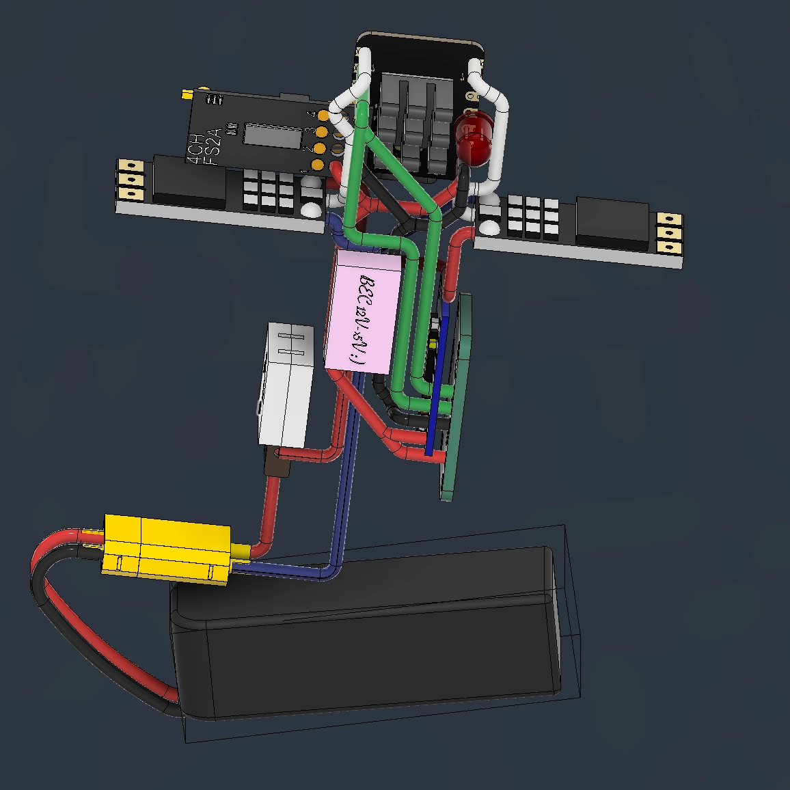
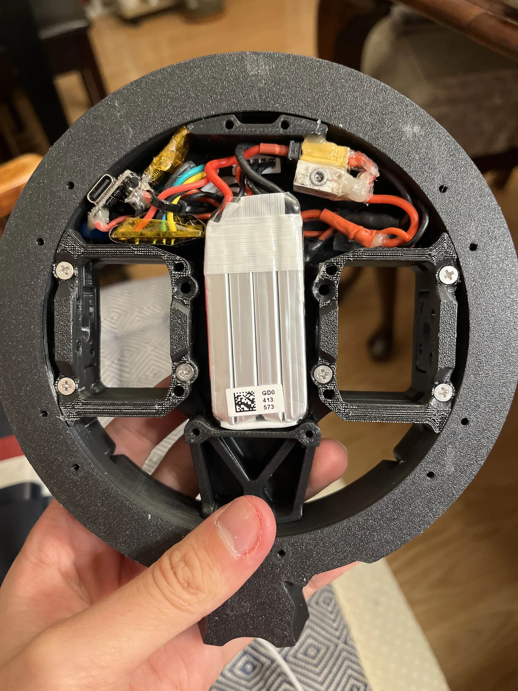
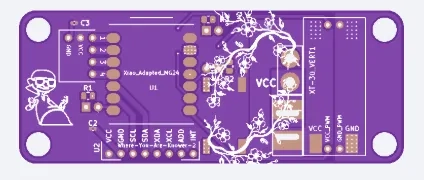
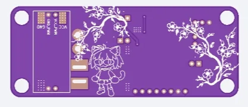
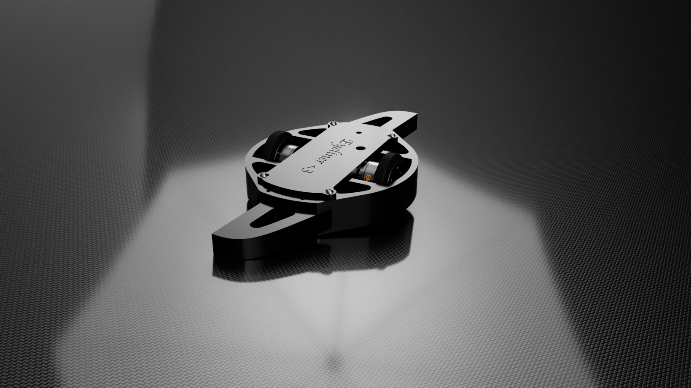
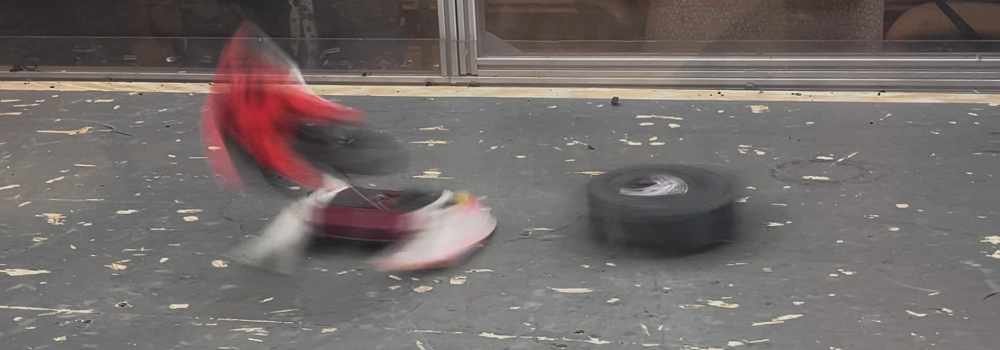

# Bring-Up Notes: Eyeliner
**Lead Engineer:** Mike Wen

---

## Latest Iterations

### Byeliner — Beetleweight Upscale V0 *(March 2026 – Present)*
**Class:** 3lb (beetleweight)
**Hardware Changes:** Oversize 790 kV 3548 motors, dual 80A 8s-capable VORTEX F65 ESCs, dual 4s LiHV batteries

A 3lb version ("Byeliner") built for **Robobrawl**, early April 2026. The chassis is a rigid CURV and aluminum skeleton wrapped in TPU. On the code side, we are also moving towards platformIO for more organized operation.

---

### V2 PCB — Second Electronics Revision *(January – March 2026)*
**Hardware:** XIAO ESP32-S3 PLUS MCU, LSM6DSV320X IMU, Repeat Robotics BEC, ELRS nano receiver, dual 35A ESCs, ws2812b LED strip, Standalone ADXL-375 Accelerometer, redesigned compact PCB

More cautious design process — reviewed by ~6 upperclassmen and EE professionals, with stringent checks for signal integrity, DFM, intercction between interfaces with each component, and transients protection at each level. Much more compact layout than V1. The LGA package high range accelerometer worked first try despite having 12 closely-spaced (0.1mm spacing) pins blindly soldered on the bottom of the package.

- Changed to "PLUS" layout of MCU for more GPIO ports
- Extensive consideration for signal integrity, decoupling and bulk capacitance, and transients protection on all vulnerable MCU GPIO ports
- Made to run on 4s-6s LiHV with minimal changes (TVS diode change), interface with a range of possible sensors, and run interchangeably with antweight and beetleweight electronics
- Interchangeable high-kv 2207 "pacer" motors (outright top-range hitting power) and low-kv 2822 motors (faster spin-up with less current draw)
- LSM6DSV320X IMU with high and low range readout registers, built-in impact detection and interrupt capability, SPI interface 
- Custom UART interface for ELRS receiver to improve signal stability and expand channel bandwidth to 16 channels 
- LED strips for better heading and state indication
- Spare set of SPI connections for standalone ADXL375 or other sensors
- Shock isolated mounting with bracing for connectors
- Judicious ground plane placement for good return paths and receiver signal integrity, high-speed trace routing to reduce cross-talk and RC-loss, balancing current surge protection and voltage surge protection with 
- Up to 2500W burst capacity on HV side via solder busses, structural stability via extensive via stitching
- Spare GPIO connections for thermistors, IR sensors, etc...
- Switched to DSHOT600 and DSHOT1200 for better motor control, built-in twisted-pairs for signal lines with GND return paths as close as possible to ESC grounds
- Kept BEC off-the-shelf since I had a lot of spares on hand and wanted to save costs

Remaining issues on first board: BEC footprint was flipped again (oops!), BEC needs to be swapped out eventually for smaller footprint and more stable 5V output, slight voltage surge on 5V side would fry all downstream 5V-to-VDDIO regulators

---

### V1.5 — Organizational Lessons *(June – December 2025)*

**Hardware:** XIAO ESP32-S3 MCU, Repeat Robotics BEC, dual 32-bit 35A ESCs, 4-channel FS2A  Receiver, Standalone ADXL-375 Accelerometer

Focused on identifying layout and harness mistakes from the first two-thirds of the year: radially-routed wires stressed solder joints, ESCs sat directly under the battery, and shock isolation was inadequate. Groundwork laid for a proper second PCB attempt.

Over two competitions during summer 2025 and a few in the fall, I learned a lot about how to secure electronics in high impact environments and probably took a few too many pitfalls in putting off a second version of the PCB. The bot could consistently maintain heading throughout the RPM range and exhibit some translational control while spun-up, and could slug it out over a full day of successive 3-minute matches. However, reliability on the logic side was still lacking, with the power output and inefficiency of the cheap high-kV 2205 motors being the main limiting factor for spin-up performance.

- Structural changes to reduce stress risers
- Improved part replaceability and modularity
- Wheels and impactors now swappable
- Chassis is still compatible with newer electricals
- Moved to higher discharge capability 3s LiHV battery

Key issues: Delicate 22 gauge wire connections on logic side (despite strain leaving wire length in the harness for strain relief) tended to pull out under impact. Solder joints were prone to fatigue over many testing and match cycles, wires sometimes failed far from solder joints. Digital interrupt-based "clock recovery" often resulted in bad PWM signal integrity from receiver.

---

### V1 PCB — First Electronics Revision *(February 2025)*
**Hardware:** Seeed Studio XIAO ESP32-MG24 SENSE MCU, 4-channel FS2A  Receiver, dual 32-bit 35A ESCs, custom PCB (first attempt)

First PCB design attempt. Notable mistakes:
- BEC footprint flipped — had to solder the module on backwards
- All SMD component footprints were one size too large, requiring sketchy diagonal mounting
- Power switch placed in an inaccessible orientation
- ESP32-MG24 SENSE line proved wholly unsuited to high-fidelity PWM output
- Decoupling caps downstream of BEC caused every board to short 5V to GND
- Initially used MPU6050 footprint before defaulting to high-range accelerometer
- Repeat "AM32 Drive ESCs" - 32-bit firmware running on custom settings for torque
- Lower discharge 3s LiPo battery

Iterated MCU choices through ESP32-WROOM → XIAO S3, which proved reliable. PCB effectively non-functional; bot continued to run on discrete wiring.

---

### V0 — Initial Development *(August 2024 – May 2025)*
**Hardware:** 2× RS2205 motors, BLHeli_S ESCs (8-bit), Teensy 4.1, MPU6050 IMU, 4-channel FS2A  Receiver

First build; no PCB, hand-wired harness. Major issues included:
- MPU6050 maxes out at ~600 RPM — inadequate for a melty-brain
- BLHeli_S ESC arming/failsafe behavior was poorly documented and unreliable
- Teensy 4.1 burned out from a poor soldering job
- Eventual switch to Seeed Studio XIAO ESP32-S3 for compactness
- Switch to ADXL375 breakout board for high-range accelerometer

Competed December 2024 in "dumb melty" mode (receiver wired directly to ESCs). Still landed solid hits, including splitting an opponent's chassis. Informal May 2025 comp ran the same way — destroyed several opponents' weapons.