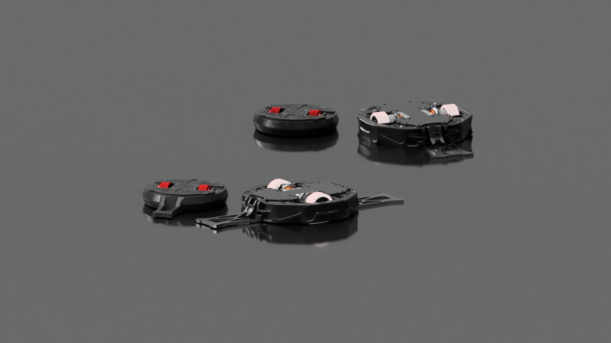
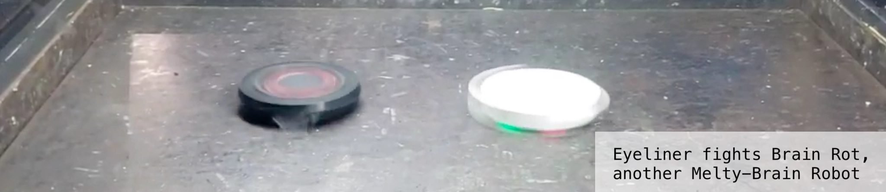
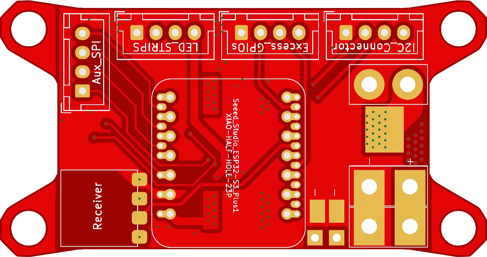
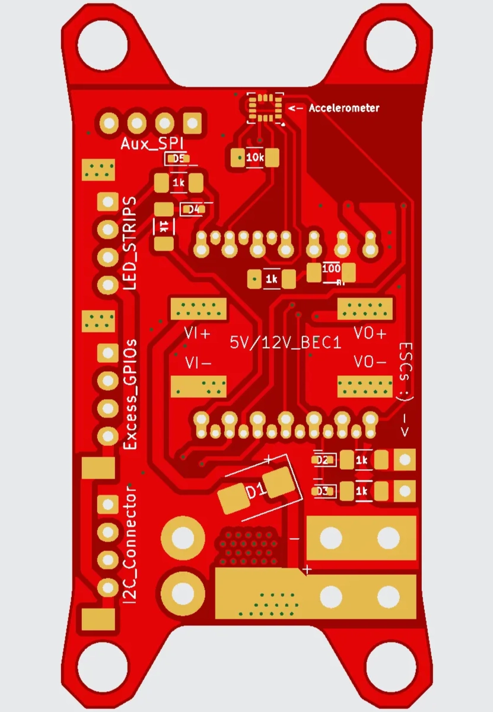
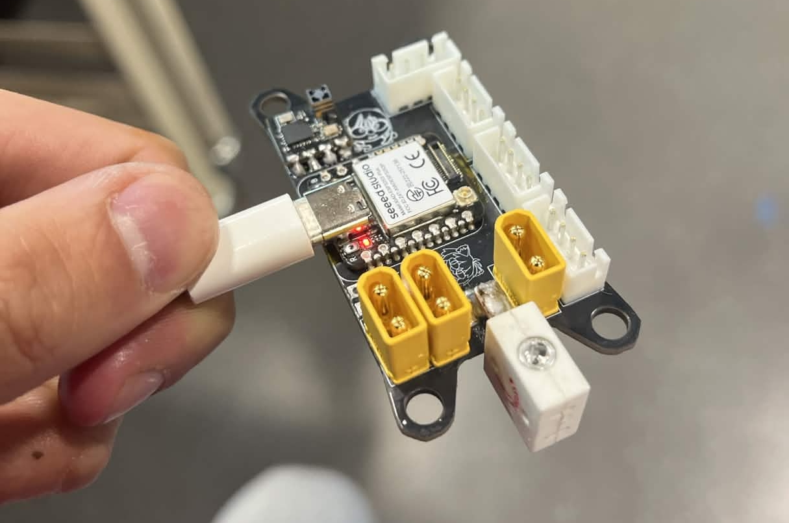
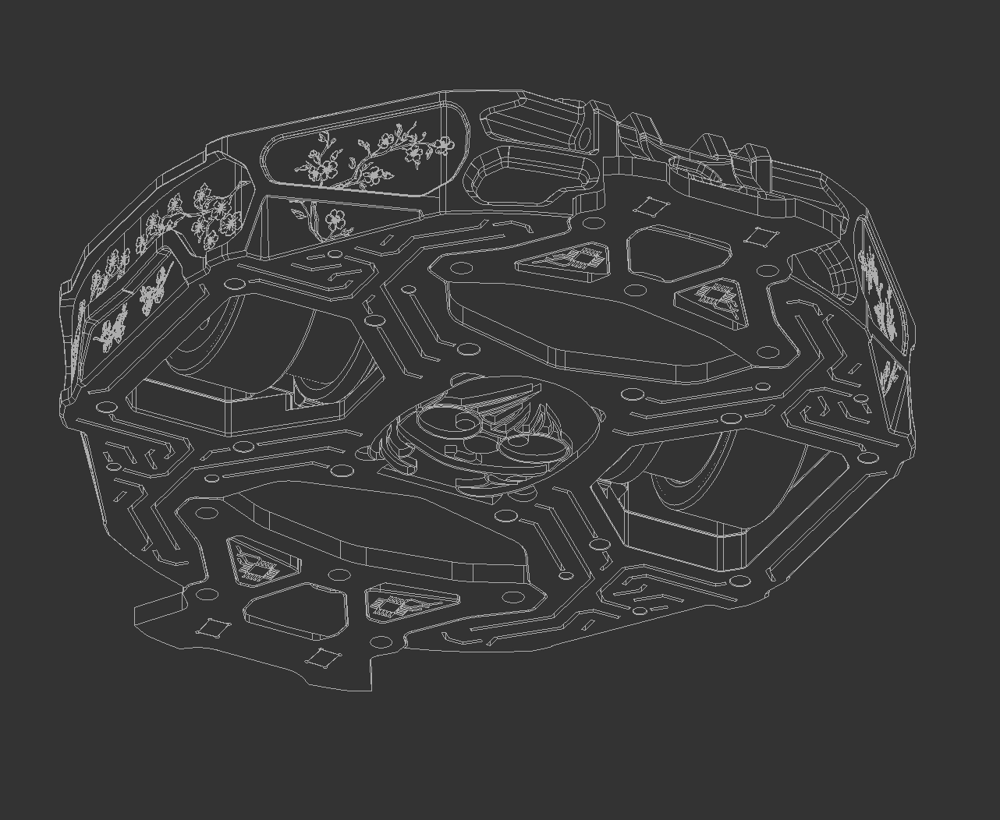
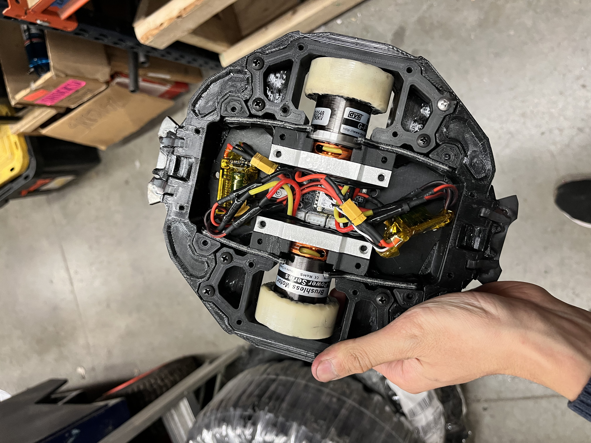

# Eyeliner — Melty-Brain Combat Robot

A 1lb (antweight) melty-brain combat robot. A melty-brain spins the entire chassis at 1,000–2,000 RPM while pulsing drive motors ~100 times/second to achieve controlled translational movement — maximum hitting power, and one of the hardest archetypes to execute correctly.

**Key system requirements:** MHz-range onboard MCU, high-range accelerometer (~400g) for RPM/heading, per-motor drive current of ~30A (≈500W), and all electronics surviving constant 200–300g with peak impact accelerations orders of magnitude higher.

To read more about the development of the project and past versions, check out my personal technical blog [here](https://future-wool-0d5.notion.site/Eyeliner-Melty-brain-Combat-Robot-2ede4d628bf380b29920f43a3518d5c0) :)

---

## Current Iteration

**Hardware:** XIAO ESP32-S3 PLUS MCU, LSM6DSV320X IMU, Repeat Robotics BEC, ELRS nano receiver, dual 35A ESCs, ws2812b LED strip, Standalone ADXL-375 Accelerometer

**Key Features:**

- Extensive consideration for signal integrity, decoupling and bulk capacitance, and transients protection on all vulnerable MCU GPIO ports
- Made to run on 4s-6s LiHV with minimal changes (TVS diode change), interface with a range of possible sensors, and run interchangeably with antweight and beetleweight electronics
- Interchangeable high-kv 2207 "pacer" motors (outright top-range hitting power) and low-kv 2822 motors (faster spin-up with less current draw)
- LSM6DSV320X IMU with high and low range readout registers, built-in impact detection and interrupt capability, SPI interface 
- Custom UART interface for ELRS receiver to improve signal stability and expand channel bandwidth to 16 channels 
- LED strips for better heading and state indication
- Spare set of SPI connections for standalone ADXL375 or other sensors
- Shock isolated mounting with bracing for connectors
- Judicious ground plane placement for good return paths and receiver signal integrity, high-speed trace routing to reduce cross-talk and RC-loss, balancing current surge protection and voltage surge protection with TVS Diodes
- Up to 2500W burst capacity on HV side via solder busses, structural stability via extensive via stitching
- Spare GPIO connections for thermistors, IR sensors, etc...
- DSHOT600 and DSHOT1200 for high rate and accurate motor torque control at speed, built-in twisted-pairs for signal lines with GND return paths as close as possible to ESC grounds

**Upcoming Changes:** 

- Dual LSM6DSV320X IMUs
- More robust LDO system for 5V side
- Precharge circuit for higher-voltage inputs
- Two-way DSHOT for traction control
- Easily-removable high-speed connectors for ESCs
- Switch to STM32 for higher clock speeds, ESP32 for telemetry and LED control only
- Custom sensored ESCs
- Custom BMS

---

### Byeliner — Beetleweight Upscale V0 *(March 2026 – Present)*
**Class:** 3lb (beetleweight)
**Hardware Changes:** Oversize 790 kV 3548 motors, dual 80A 8s-capable VORTEX F65 ESCs, dual 4s LiHV batteries

A 3lb version ("Byeliner") built for **Robobrawl**, early April 2026. The chassis is a rigid CURV and aluminum skeleton wrapped in TPU. On the code side, we are also moving towards platformIO for more organized operation.

---